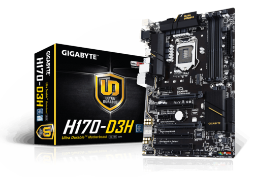

<h1 align="center">Hackintosh the H170-D3H</h1>

    
    
    
    
    

    

#### <h2 style="color: #02f6d2" >I am not responsible for any damages you may cause.<h1>
#### <h2 style="color:red" >Be careful, this work is very dangerous, if you don't have the necessary information about the hardware and do not need a Mac, Don't do it<h1>
#### If my work here helped you. Please give me stars to support me

- Complete EFI packs are available in the releases page.
- I will try my best to keep the repo updated with the latest kexts and OpenCore version.
- Please **do not clone or download** the main branch for daily use: it may include **unstable code** just because it is my repository.
- This EFI is configured with Catalina, Big Sur and Monterey.
- Clean Ubuntu and Windows efi Folder ,they are not work for you , I placed them to  show linux and windows efi position , If you have multi booting

<strong> SUMMARY </strong>

 

> ### Video and Audio

| Feature                              | Status | Dependency                                             |
|:-------------------------------------|--------|--------------------------------------------------------|
| Full Graphics Accleration (QE/CI)    | ✅      | `WhateverGreen.kext`                                   |
| Audio Recording                      | ✅      | `AppleALC.kext` with Layout ID = 7 and `SSDT-HPET.aml` |
| Audio Playback                       | ✅      | `AppleALC.kext` with Layout ID = 7 and `SSDT-HPET.aml` |
| Automatic Headphone Output Switching | ✅      | `AppleALC.kext` with Layout ID = 7 and `SSDT-HPET.aml` |
| Dock Audio Port                      | ✅      | `AppleALC.kext` with Layout ID = 7 and `SSDT-HPET.aml` |

> ### Power, Charge, Sleep and Hibernation

| Feature                 | Status | Dependency                                                                                                                 |
|:------------------------|--------|----------------------------------------------------------------------------------------------------------------------------|
|  Power Management       | ✅      | enabled by [`SSDT-PMC.aml`]                                                                                                |                                                                                       |
| Custom Power Management | ✅      | `SSDT-EC.aml`                                                                                                              |
| Fan Control             | ✅      | `SSDT-EC.aml` |
|

> ### Input/ Output

| Feature                       | Status | Dependency                                    |
|:------------------------------|--------|-----------------------------------------------|
| Ethernet                      | ✅      | `IntelMausi.kext`                             |
| USB 2.0, Custom Map for USB 3 | ✅      | `USBPorts.kext`                               |
| USB Power Properties in macOS | ✅      | `SSDT-EC-USBX.aml`                            |
| Wireless Dongle TL-WN725N     | ✅      | `RealtekRTL8111.kext`,`RtWlanU1827.kext`, `RtWlanU.kext`, |

> ### macOS Continuity

| Feature                              | Status | Dependency          |
| :----------------------------------- | ------ | ------------------- |
| iCloud, iMessage, FaceTime           | ✅   | Whitelisted Apple ID, Valid SMBIOS  |
| AirDrop                              | ✅   | Not tested  |
| Time Machine                         | ✅   | Native  |

<strong> REFERENCES </strong>

 

Read these before you start:

- [dortania's Hackintosh guides](https://github.com/dortania).
- [dortania's OpenCore Install Guide](https://dortania.github.io/OpenCore-Install-Guide/).
- [dortania's OpenCore Post Install Guide](https://dortania.github.io/OpenCore-Post-Install/).
- [dortania/ Getting Started with ACPI](https://dortania.github.io/Getting-Started-With-ACPI/).
- [dortania/ opencore `multiboot`](https://github.com/dortania/OpenCore-Multiboot).
- [dortania/ `USB map` guide](https://dortania.github.io/OpenCore-Post-Install/usb/).
- [WhateverGreen Intel HD Manual](https://github.com/acidanthera/WhateverGreen/blob/master/Manual/FAQ.IntelHD.en.md).
- `Configuration.pdf` and `Differences.pdf` in each `OpenCore` releases.

<strong> REQUIREMENTS </strong>

 

- A macOS machine(optional): to create the macOS installer.
- Flash drive, 12GB or more, for the above purpose.
- Xcode works fine for editing plist files on macOS, but I prefer [PlistEdit Pro](https://www.fatcatsoftware.com/plisteditpro/).
- [ProperTree](https://github.com/corpnewt/ProperTree) if you need to edit plist files on Windows.
- [MaciASL](https://github.com/acidanthera/MaciASL), for patching ACPI tables and editing ACPI patches.
- [MountEFI](https://github.com/corpnewt/MountEFI) to quickly mount EFI partitions.
- [IORegistryExplorer](https://developer.apple.com/downloads), for diagnosis.
- [Hackintool](https://www.insanelymac.com/forum/topic/335018-hackintool-v286/), for diagnostic ONLY, Hackintool should not be used for patching, it is outdated.
- Patience and time, especially if this is your first time Hackintosh-ing.

<strong> HARDWARE </strong>

<h5>My Hardware</h5>

| Category     | GA-H170-D3H                                     |
|--------------|-------------------------------------------------|
| CPU          | Intel Core i5-6400                              |
| Motherboard  | GA-H170-D3H                                     |
| RAM          | 16G DDR4                                        |
| SSD          | Samsung 970 Evo Plus 250GB                      |
| Display      | Any Monitor                                     |
| WiFi         | Intel wireless dongle wn725n OR any Mac Support |
| Graphic Card | RX580 OR Any ...                                |  

<strong> GETTING STARTED </strong>

 

Before you do anything, please familiarize yourself with basic Hackintosh terminologies and the basic Hackintosh process by throughly reading Dortania guides as linked in `REFERENCES`

- Creating a macOS installer: refer to [Dortania's OpenCore Install Guide](https://dortania.github.io/OpenCore-Install-Guide/installer-guide/)

<strong> BENCHMARKS </strong>

 

- macOS 12.6.2, EFI OpenCore 0.9.3

[//]: # (| CPU            | Single-Core | Multi-Core |)

[//]: # (| :------------- | ----------: | ---------: |)

[//]: # (| Cinebench R23  |             |       1576 |)

[//]: # (| Geekbench 5    |         694 |       1421 |)

[//]: # ()
[//]: # (| GPU            | OpenCL      | Metal      |)

[//]: # (| :------------- | ----------: | ---------: |)

[//]: # (| Geekbench 5    |        1028 |        193 |)

# CONTACT

- Email: javadamin93@gmail.com
- Telegram: @javadamin1
- WebSite : JavadFathi.ir

# Credits

- [Apple](https://www.apple.com) for macOS.
- [Acidanthera](https://github.com/acidanthera) for all the kexts/utilities that they made.
- [Rehabman](https://github.com/RehabMan) and [Daliansky](https://github.com/daliansky) for the patches and guides and kexts.
- [Dortania](https://github.com/dortania) for for the OpenCore Install Guide.

